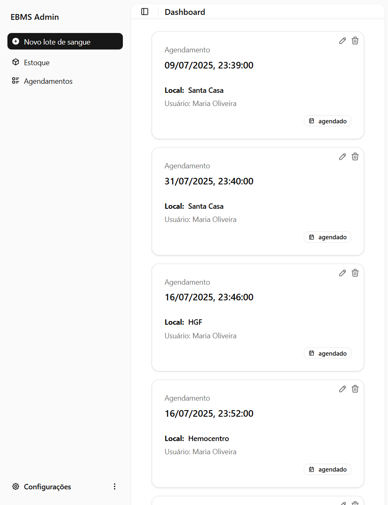
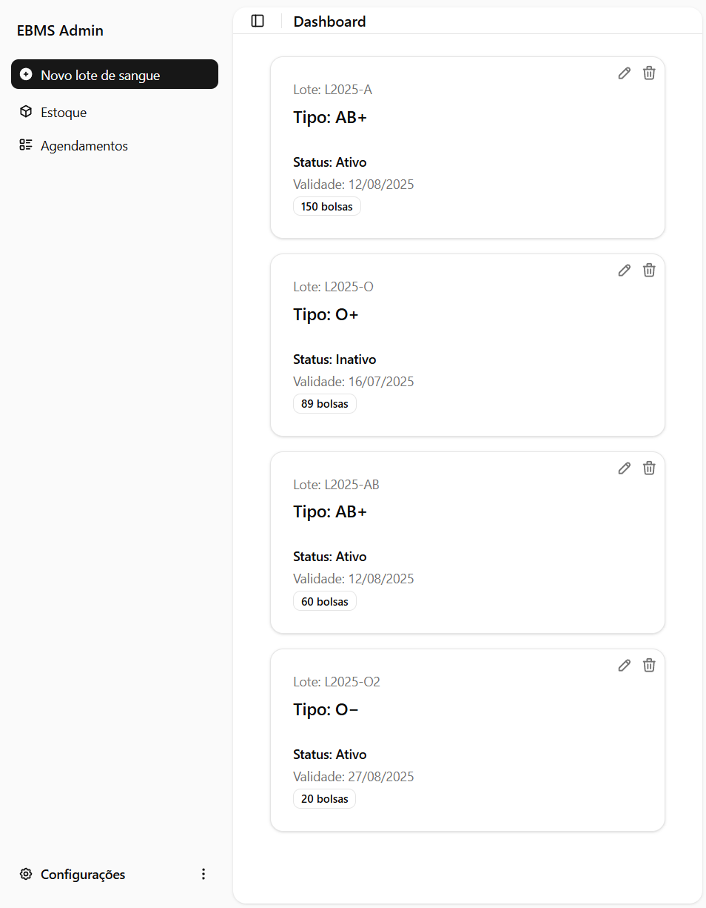

# 🩸 EBMS Frontend - Sistema de Gerenciamento de Banco de Sangue

Bem-vindo ao repositório do **EBMS Frontend**, a interface web desenvolvida para auxiliar no gerenciamento de doadores, agendamentos e estoque de sangue.  
Feita com foco em usabilidade, acessibilidade e visual limpo para facilitar o uso por administradores e doadores! 🚑❤️

---

## 💻 Tecnologias Utilizadas

- **Next.js** `15.4.1`
- **TypeScript**
- **React Hook Form** `7.x`
- **Zod** `3.x`
- **TailwindCSS** `3.x`
- **Axios** (requisições HTTP)
- **JWT Decode** (autenticação)

---

## 🧱 Estrutura do Projeto

```bash
/components → layout, cards, estoque
/pages      → /admin, /user
/services   → API, agendamentos, estoque
```

---

## 🌐 API Utilizada

Este front-end consome a [EBMS API](https://github.com/guillxr/ebms_API), disponível publicamente.

---

## 🧪 Funcionalidades

- Login com autenticação JWT
- Dashboard para administradores e doadores
- Agendamento de doações
- Gerenciamento de estoque de sangue
- Edição de perfil (doadores)
- Feedback visual em tempo real e responsividade

---

## 📸 Imagens do Projeto

> Exemplo da interface de agendamentos:



> Tela de edição de estoque:



---

## ⚙️ Como rodar o projeto

### 1. Clone o repositório

```bash
git clone https://github.com/guillxr/ebms-Frontend.git
cd ebms-Frontend
```

### 2. Instale as dependências

```bash
npm install
```

### 3. Configure as variáveis de ambiente

Crie um arquivo chamado `.env.local` na raiz do projeto e adicione:

```env
NEXT_PUBLIC_API_URL=http://localhost:3001
JWT_SECRET=M4_PdA
```

> ✅ `NEXT_PUBLIC_API_URL` aponta para a URL da API.  
> 🔐 `JWT_SECRET` é usado para validação local do token JWT no front-end (simulação segura).

---

### 4. Execute o projeto

```bash
npm run dev
```

A aplicação estará disponível em: [http://localhost:3000](http://localhost:3000)

---

## 📎 About

- 🌐 [Site em produção](https://ebms-frontend.vercel.app/)
- 🔗 [Postagem no LinkedIn](https://www.linkedin.com/posts/devgustavo-io_react-nextjs-typescript-activity-7351772345222520835-sK4X/)

---

## 🤝 Colaboradores

Este projeto foi desenvolvido por:

- Gustavo Souza [@guillxr](https://github.com/guillxr)
- Matheus Henrique [@matheeusshn](https://github.com/matheeusshn)
- Melissa Pinheiro [@mel-pinheiro](https://github.com/mel-pinheiro)
- Sávio Borges [@Savitoo0](https://github.com/Savitoo0)
- Rayane Gonçalves [@rayanegoncalvesaraujo](https://github.com/rayanegoncalvesaraujo)
- Pedro Washington [@pwzx07](https://github.com/pwzx07)

---

## 📩 Contribua!

Encontrou um bug ou tem sugestões? Sinta-se à vontade para abrir uma **issue** ou enviar um **Pull Request**.

Feito com 💙 por toda a equipe EBMS.